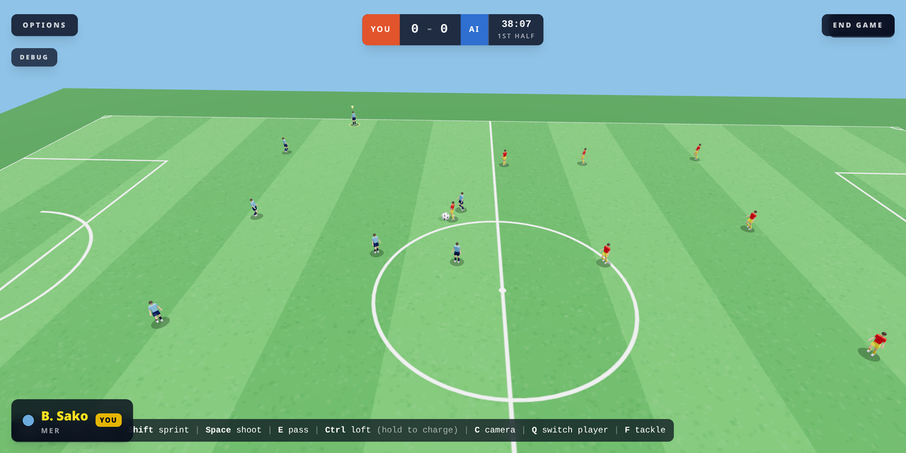

# Goodball - Arcade Football

[](https://github.com/cheapsnack/goodballl/actions/workflows/ci.yml)
[](https://goodball.lovable.app)
[](https://docs.pmnd.rs/react-three-fiber)
[](#license)

A 3D arcade football (soccer) game: 11 v 11 matches, penalty shootouts, free-kick
practice and online 1 v 1, built with React Three Fiber on TanStack Start.

**Play it:** <https://basicfootball.lovable.app> — no install, works on desktop and mobile.



## Features

- Full match mode with two halves, a 15x match clock, extra time and penalties
- Formation-aware AI (goalkeepers, pressing, zonal shape, mentality, bookings)
- Fouls, yellow and red cards — teams play on with 10 or 9
- Charge-based shooting and passing, slide tackles, restarts (throw-ins,
  corners, goal kicks, free kicks, penalties)
- Standalone Penalty Shootout and Free Kick modes with difficulty levels
- Local 1 v 1 (two key schemes on one keyboard) and online rooms over Supabase
  Realtime
- Broadcast and run cameras, stadium with crowd in club colours
- Touch controls on mobile, keyboard on desktop

## Tech stack

- TanStack Start (React 19, file-based routing) + Vite
- React Three Fiber / drei / three.js for rendering
- Zustand for game state
- Tailwind CSS v4 for UI overlays
- Supabase (Lovable Cloud) for multiplayer rooms
- Vitest for the pure game-logic tests

## Getting started

```
bun install
bun run dev   # http://localhost:8080
```

Copy `.env.example` to `.env` and fill in the Supabase values. Multiplayer is
the only feature that needs them; everything else runs without.

## Scripts

| Command          | Purpose                 |
| ---------------- | ----------------------- |
| `bun run dev`    | Dev server              |
| `bun run build`  | Production build        |
| `bun run test`   | Vitest game-logic suite |
| `bun run lint`   | ESLint                  |
| `bun run format` | Prettier                |

CI runs tests and a production build on every push (see `.github/workflows/ci.yml`).

## Project structure

```
src/
  components/game/   R3F scenes and HUD overlays (match, stadium, set pieces, menus)
  game/
    data/clubs.ts    8 clubs, 16 players each (generated — do not hand-edit)
    logic/           Pure, unit-tested gameplay: physics, AI, match rules
    store/           Zustand store shared by scene + UI
  hooks/             Keyboard and touch input
  multiplayer/       Supabase room client, channel and snapshot encoding
  routes/            TanStack Start routes (single game route)
docs/                Architecture notes, roadmap, screenshots
```

Everything under `src/game/logic` is framework-free and covered by tests; the
components only render state produced there. See
[docs/ARCHITECTURE.md](./docs/ARCHITECTURE.md) for the conventions and
[docs/ROADMAP.md](./docs/ROADMAP.md) for what's next.

## Controls

Move `WASD` / arrows · Sprint `Shift` · Shoot `Space` · Pass `E` ·
Loft `Ctrl` · Slide `F` · Switch player `Q` · Camera `C`.
In-game Options (top-left) pauses the match and lists the full scheme.

## License

All rights reserved. This code is public for visibility only — no license is
granted to use, copy, or redistribute it.
